# Software Engineering Spaceship Collaboration 🚀

<div align="left">


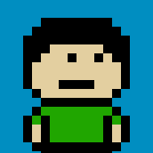
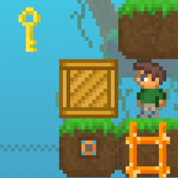

</div>

<table>
<tr>
<td>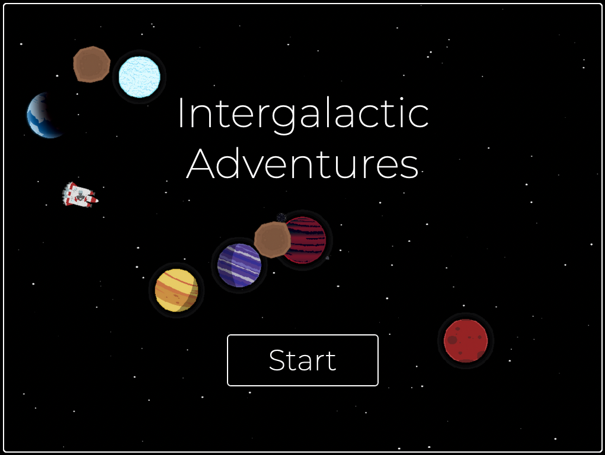</td>
<td>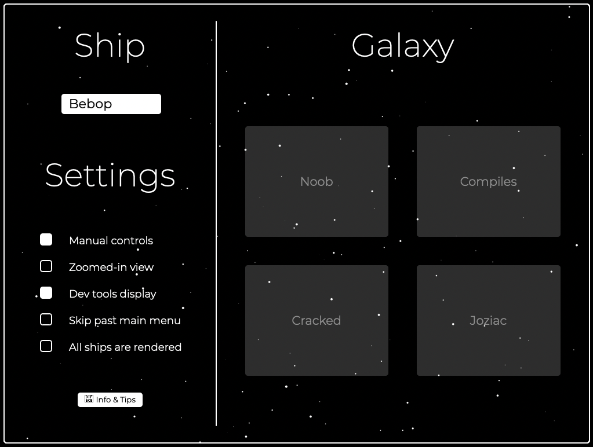</td>
<td>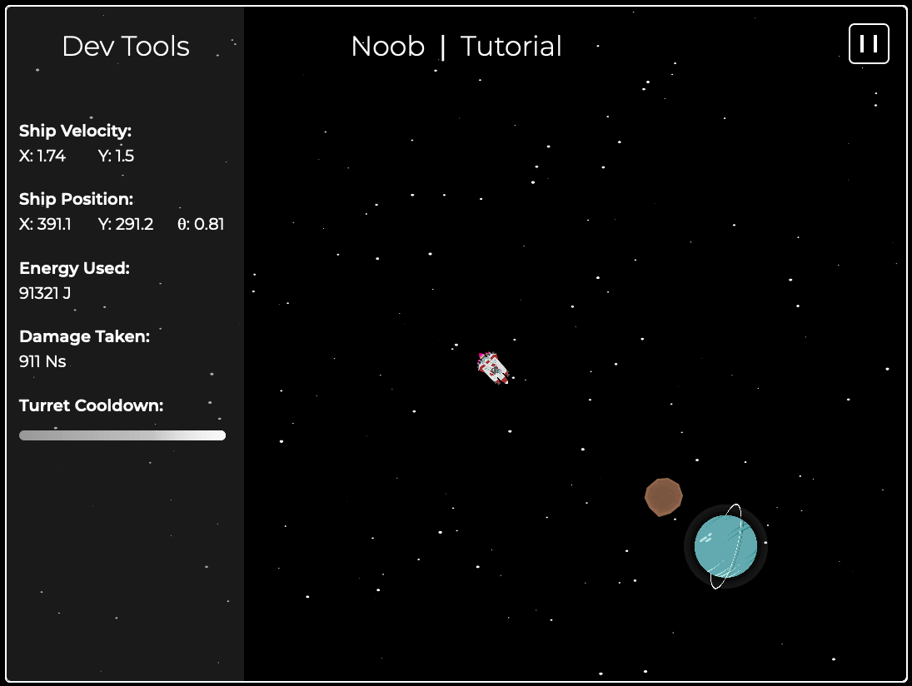</td>
</tr>
<tr>
<td>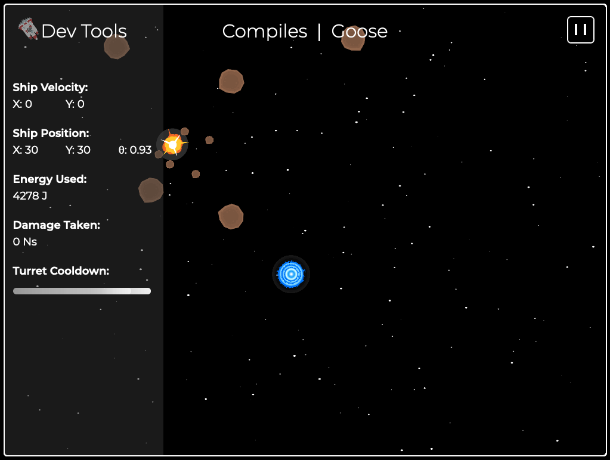</td>
<td>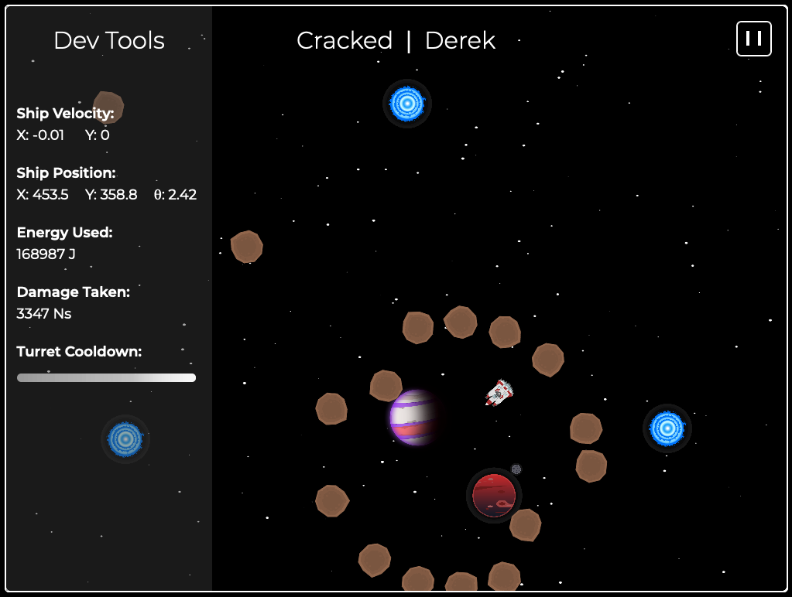</td>
<td>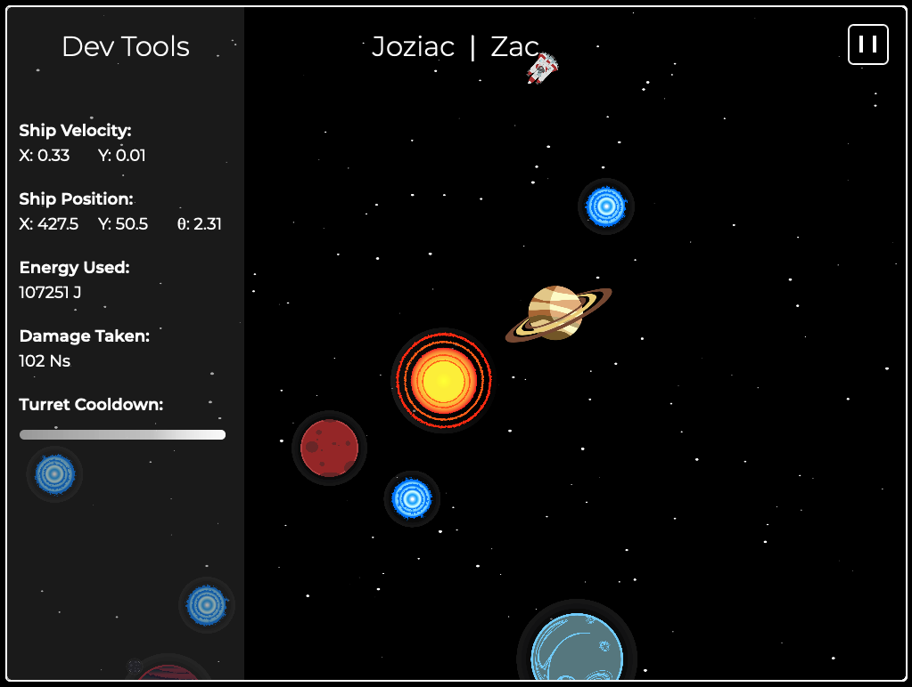</td>
</tr>
</table>

## University of Waterloo Ideas Clinic 💻

_Adventure and glory await you!_ With the recent discovery of the galactic warp gate network, an international coalition of world governments has been hard at work designing and constructing humanity’s first interstellar colony ships. Bound for Kepler-438b, an exoplanet only 472.9 light-years away from Earth, in the constellation Lyra, you and your colleagues have been tasked with developing the software control systems that will guide the ship through the hazards of deep space. The fate of thousands of pioneering souls, and in turn that of all of humanity, rests on your collective ability to design, implement, test your code, and _work as a team!_


---

### Credits:

-   Faculty & Staff: Derek Rayside, John Harris
-   Student Volunteers: Zac Waite, Josiah Plett

## Table of Contents

### 1: [Playing the Game](#1)

-   1.1: [Main Menu](#1.1)
-   1.2: [Manual Controls](#1.2)
-   1.3: [Game Objectives](#1.3)

### 2: [Installation](#2)

-   2.1: [Set up Git](#2.1)
-   2.2: [Download the source code](#2.2)
-   2.3: [Install a server](#2.3)
-   2.4: [Install TypeScript](#2.4)
-   2.5: [Understand the Console](#2.5)

### 3. [Objectives](#3)

-   3.1: [Project Goal](#3.1)
-   3.2: [Learning Objectives: Teamwork](#3.2)
-   3.3: [Open-Ended Design](#3.3)
-   3.4: [Working Outside Your Comfort Zone](#3.4)
-   3.5: [How to Manage Feeling Lost or Overwhelmed](3.5)
-   3.6: [Feelings Beyond This Activity](#3.6)

### 4: [Team Design Methods](#4)

-   4.1: [Traditional Design: Divide & Conquer](#4.1)
-   4.2: [Modern Design: Integrate & Iterate](#4.2)

### 5: [TypeScript/JavaScript Language](#5)

-   5.1: [JavaScript Tips](#5.1)
-   5.2: [JavaScript Data Structures](#5.2)
-   5.3: [TypeScript Types](#5.3)
-   5.4: [TypeScript Compilation](#5.4)

### 6: [The Joziac Game Engine](#6)

-   6.1: [The Game Loop](#6.1)
-   6.2: [Coordinate System](#6.2)
-   6.3: [Helper Libraries](#6.3)

### 7: [Student API](#7)

-   7.1: [Your Ship](#7.1)
-   7.2: [Navigation](#7.2)
-   7.3: [Sensors](#7.3)
-   7.4: [Defence](#7.4)
-   7.5: [Propulsion](#7.5)
-   7.6: [Integration](#7.6)
-   7.7: [Using TypeScript](#7.7)
-   7.8: [Using JavaScript](#7.8)

### 8: [Advanced Information](#8)

<h2 id='1'>1: Playing the Game!</h2>
<h3 id='1.1'>1.1: Main Menu</h3>


-   On the main menu screen, there are several options/settings.

**Ship Select**:

-   Select the ship you want to play as - this will change which code is used from the `students` folder.

**Settings**:

-   Toggle `Zoomed-in view` for a better view of the ship, or a better view of the map.
-   Toggle `Dev tools display` to see ship stats like position, speed, energy used and damage taken on the left side of the screen.
-   Toggle `Skip past main menu` to skip the galaxy select when you open the browser, for smoother testing.
-   Toggle `All ships are rendered` to see all of the ships on the map, not just the ones you are in control of.

**Galaxy**:

-   These are the levels you can play on - they get progressively harder.
-   `Noob`: Easy
    -   1 Solar System, 1 planet. Just go to the planet.
-   `Compiles`: Medium
    -   3 Solar Systems, 2 planets.
    -   Use warp gates to travel between solar systems.
    -   Pick the most survivable planet.
-   `Cracked`: Hard
    -   5 Solar Systems, several planets.
    -   Navigate a looping maze of warp gates.
    -   Pick the most survivable planet, even if that means leaving a solar system behind.
-   `Joziac`: Impossible
    -   7 Solar Systems, many planets.
    -   Completely new challenges.
    -   A labyrinth of dynamic warp gates.
    -   To truly beat the game, you must land on **_Planet Joziac_**.

<h3 id='1.2'>1.2: Manual Controls</h3>

-   `🠔🠕🠖🠗 [arrows]` or `WASD` to move the ship.
-   `[space]` to fire weapons; when in manual control, torpedoes will fire forward.
-   `M` to warp through a warp gate.
-   `L` to land on a planet.

    _Manual controls are disabled on your ship if the `setThrusters` function is called_

<h3 id='1.3'>1.3: Game Objectives</h3>

-   **The goal of the game is the land on the best planet you can, without taking too much damage, and without using too much energy**
-   When in manual mode, you will have to make assumptions based on the look of the planet. When you are close to the planet during automatic mode, however, you can scan the planet to see its composition.
-   Use warp gates to travel between solar systems. Warping has a high energy cost, though.
-   Avoid asteroids, or destroy them with torpedoes to escape taking damage. When a large asteroid explodes, it will split into smaller asteroids.
-   You have unlimited torpedoes, but they're on a cooldown timer, and require some energy to fire.
-   Your thrusters use a lot of energy, but you also use some energy at rest, so don't be too idle.

<h2 id='2'>2: Installation</h2>

<h3 id='2.1'>2.1: Set up Git</h2>

-   After prompting by your professor, expect to spend 5 or 15 minutes working through [this task](https://uwaterloo.atlassian.net/wiki/spaces/EIC/pages/31752064908/Git+Basics+of+Source+and+Version+Control).
-   It teaches an essential technology to software engineering: Git.

<h3 id='2.2'>2.2: Download the source code</h3>

-   Get yourself a [GitHub account](https://github.com/signup) if you don't already have one.
-   Find our Repository on Github [here](https://github.com/zrwaite/SE101-Spaceship).
-   Star the Repo!
    -   
-   Follow [Zac](https://github.com/zrwaite) and [Josiah](https://github.com/plettj) on GitHub!
    -   
-   Have one team member fork the repo into their account.
    -   
-   Clone the forked repo onto your computer:
    -   `git clone https://github.com/{team member username}/SE101-Spaceship`

<h3 id='2.3'>2.3: Install a server</h3>

-   To run your JavaScript code, you will need an http server. \*_If you already have one, you can skip this step._
-   The easiest server to install the Live Server extension on VSCode.
-   Install [VSCode](https://code.visualstudio.com/download). 
-   Install the "Live Server" extension:
    -   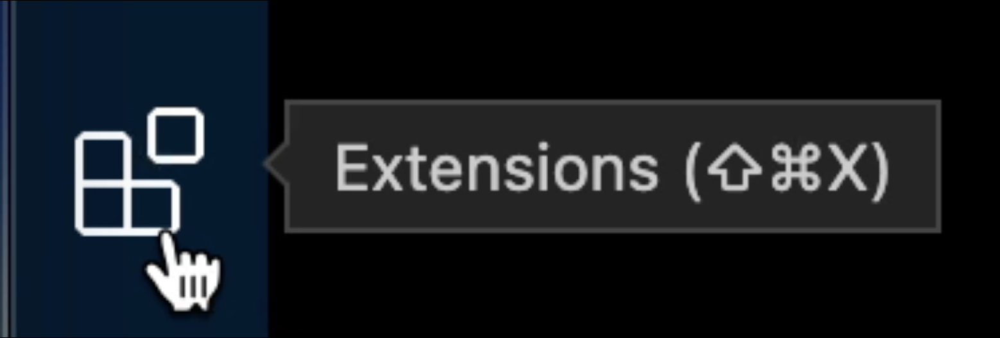
    -   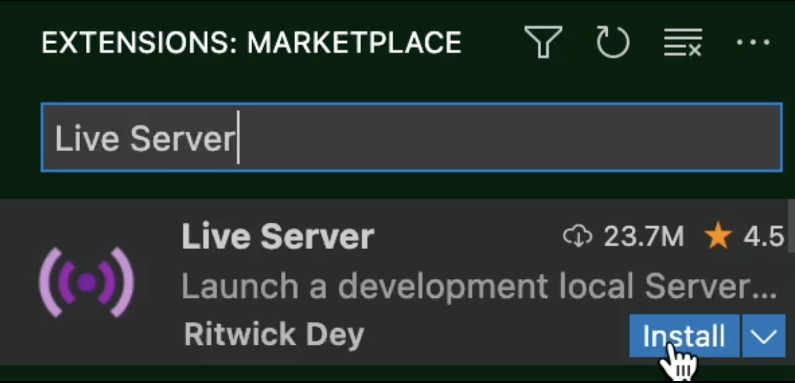
-   To run your server, open your local `SE101-Spaceship` folder (that you just cloned) in VS Code, and click the "Go Live" button at the bottom right:
    -   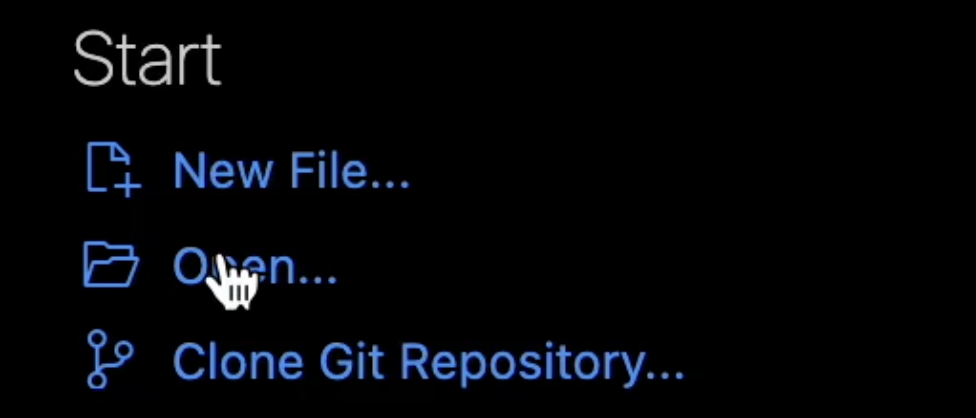
    -   
    -   You can now find the game at in your browser at http://localhost:5500/.

<h3 id='2.4'>2.4: Install TypeScript</h3>

-   If you want to code in TypeScript, for type safety and better API documentation, you will need additional installations.
-   First install [Node.js](https://nodejs.org/en/download/).
-   Next, open the VSCode terminal and run `npm i` in the terminal.
-   You can test whether Typescript is installed by running `npm run compile` to compile the TypeScript code into JavaScript.
-   To code in TypeScript, use `npm run dev` to compile your code whenever you save a Typescript file, or `tsc --watch`, for live updating.

<h3 id='2.5'>2.5: Understand the Console</h3>

(Skip this if you know about the console)

For the purposes of this project, the Javascript console is where you do your debugging.
First you need to know how to open the console, which is part of your browser. In Google Chrome (or Edge or Firefox), if you're on Mac, `CMD+ALT+J` should open it, and on Windows `CTRL+SHIFT+J` should do the trick. Otherwise, google how :).

There are two main ways to use the console, both for the purpose of debugging:
-   _Logging._ If you type `console.log("some text")` anywhere in your code, you will see the message in the console exactly when that code executes. It's most commonly used as in `console.log(variable_you_want_to_know)` or `console.log("does this execute before the error?")`.
-   _Breakpoints._ Type `debugger` anywhere in your code, and run it. Whenever that line is run, your browser (at least, Chrome) will pause and let you step slowly through its execution. This is considered a better debugging method, but we recommend starting with `console.log()` if you are new.

<h2 id='3'>3: Objectives</h2>

<h3 id='3.1'>3.1: Project Goal</h3>

Your goal is to engineer an _'AI'_ to fly your spaceship that can reliably find your crew a habitable planet. While on your journey, each solar system acts like a level in a video game. Your goal is to navigate between solar systems using warp gates to find a planet ideal for your crew. This must be accomplished while avoiding the hazards of space like asteroids, to prevent ship damage. You should also optimize the amount of energy you use for the best chance of survival on the new planet.

<h3 id='3.2'>3.2: Learning Objectives - Teamwork</h3>

Your spaceship's control system has 4 subsystems. Following is a general summary; for a more technical description, see Section 7, the [Student API](#7)

<table>
<tr>
<th>Subsystem</th>
<th>Functions</th>
</tr>
<tr>
<td>Defence</td>
<td><ul>
<li>aimTurret: Aim the ship's torpedo turret</li>
<li>getTubeCooldown: Get the time until one of your 4 turret tubes can be fired again</li>
<li>fireTorpedo: Attempt to fire a torpedo out of one of the 4 turret tubes</li>
</ul></td>
</tr>
<tr>
<td>Navigation</td>
<td><ul>
<li>warp: Attempt to use the quantum fluxtinator to travel through a nearby warp gate</li>
<li>land: Attempt to land on a nearby planet</li>
<li>mapData: Get the data about your current solar system</li>
</ul></td>
</tr>
<tr>
<td>Propulsion</td>
<td><ul>
<li>setThrusters: Set the thrust level of each of the ship's thrusters</li>
</ul></td>
</tr>
<tr>
<td>Sensors</td>
<td><ul>
<li>activeScan: Use an expensive, precise sensor to read data about all space objects in the range you define</li>
<li>passiveScan: Use low-cost, imprecise sensors to read data about some space objects in the solar system</li>
</ul></td>
</tr>
</table>

The subsystems need to work together in order for the ship to reach a habitable planet. Making this happen will require teamwork along several axes:

-   **Interpersonal**: Listen. Consider. Reciprocate. Most of you will assume you have something to contribute, and this may impare your ability to act as a team. That’s ok. But now, you get to learn to share in a way that does not denigrate your classmates; indeed, actively look for ways to celebrate their strengths. You are now in the big leagues, and hypothetically on your own. Everyone here has skills and abilities, even if you can't see them yet. Pay attention, and find something nice to say... support each other, because that is what life is. You are all in this together, and you will be together for the next five years. You're here to collaborate with your classmates — not to compete with them.
-   **Version Control (Git)**: Version control is a foundational technology for teamwork in software.
-   **Division of Labour**: How to organize the work to ensure that the subsystems integrate is a tricky problem. A common way that software systems failed in the 20th century is that all of the subsystems could perform their functionality independently, but couldn’t work together. Modern agile design techniques focus on integration and communication first, and individual functionality second.

While there is a lot of teamwork needed, teams will need people to show their leadership skills. Teams will need leaders to guide them through the hard times and be able to help the group. Leaders are essential, because there's no such thing as "we all contribute as equals;" leaders are the byproduct of the essentiality of a communicative hierarchy. So, to lead effectively, they will need to be active listeners, and to communicate effectively. They will need to be creative and be able to strategically plan on the spot. Leaders are our glue, holding together the high-functioning individual parts of our world.

<h3 id='3.3'>3.3: Open-ended Design</h3>

Open-ended design means to allow users to make their own customizations for a software to meet their needs, and that's what this project is about. You and your crewmates will have to make your own customizations for your own spaceship. Each crewmate will be given different tasks and each task will be for a subsystem given by the group, by your democratic method of choice. There are four different subsystems, and within each subsystem there will be different tasks that everyone will have to do in order to successfully complete the activity.

<h3 id='3.4'>3.4: Working Outside Your Comfort Zone</h3>

This activity is designed to push you outside your comfort zone. By definition, that will be uncomfortable. But this activity is _also_ designed to be fun. We hope Zac and Josiah's Typescript version helps streamline that fun.

Let's take a moment to explore the complex world of feelings. Being able to work outside your comfort zone is a skill — a skill that few people in the world have. You were admitted to Waterloo in part because you have the potential to develop this skill. This activity is designed to help you realize your potential — and to realize that you have this potential. Highschool was within your comfort zone; at least, near the end. Maybe, at times, it expanded your comfort zone — but it did that by pushing the boundary forwards from the inside. Now, only you have the power to push that boundary; and now, you are responsible for doing so. In this project, you'll be using TypeScript/JavaScript. It'll be comparatively easy to learn because there are many resources online, and your peers will be of great help. But you climb a mountain one step at a time, and it's likely this learning experience is your first step up the mountain of professional technical competency.

Now let's warp from the world you came from to the world you're in now. Hold on! (hehe)

Some ways this activity is outside your comfort zone:

||Highschool|Spaceship Collaboration|
|-------|-------|-------|
|Pre-requisite knowledge|Carefully provided|Uses ideas from classes you haven’t taken yet|
|Time|Just enough to do it perfectly|Not enough to make any part perfect|
|Programming Environment |Taught to you|Learned of your own accord|
|Classmates|Not as talented as you|Very talented|
|Team Size|2–6|~16|

<h3 id='3.5'>3.5: How to Manage Feeling Lost or Overwhelmed</h3>

You might feel uncomfortable during this activity. Don’t worry! These are normal feelings. This activity is a safe space for you to explore managing these feelings. These feelings are very common among high-achievers — even among high-achievers over thirty years old! If you don't like the word "common" and you think it doesn't apply to you, think again: you're in a world of people at least _very much_ like you now. The key is to learn positive strategies to manage these feelings so that they don’t ruin your fun, impede your progress, or degenerate your life by relentless attrition.

**We’re not ready to demo!** Just imagine this feeling for a moment. That’s a 20th century feeling. It’s time to let it go and embrace the new age. The industry has learned, from vast experience, that this particular flavour of perfectionism does not produce the best software overall. There are two reasons people typically have this feeling. One, the software is not integrated and connected properly; and two, the features are incomplete. A key insight of the late 20th century is that if we integrate first, then the system is always ready to demo — maybe some of the features still need to be improved, but the system does something. The value here isn't in the "doing something," but in such an attitude's ability to ensure effective and scalable software. See Section 2 to learn the right technical skills for working together this way. Integrate first; then your team will always be ready to demo functional code.

**Lost...** Have no idea what to do? Is there something you don't seem to understand? You’re feeling lost. How are you going to manage this feeling? You have choices.

**Negative:**

-   Run away! Start fiddling with your phone/computer.
-   Attack others. Uf you can show them they're vulnerable maybe they won't notice you are. Or maybe putting them down helps you keep yourself afloat.
-   Attack yourself... See Imposter Syndrome below.

**Positive:**

-   Find someone to talk to. Perhaps a teammate. Perhaps a classmate on another team. Perhaps a TA or instructor. We all feel lost sometimes.
-   Take a moment to step outside yourself. What is the best course of action in your environment? It's certainly not berating yourself.

**Overwhelmed!** Too many things! What to do next?!?! You’re feeling overwhelmed. You could let yourself, through cognitive inaction, into the easy rut of a negative behaviour. Or, you could choose a positive strategy, such as:

-   Start with something small and achievable that you're already aware of; or look for such information.
-   Reflect on your role on the team, and use that to focus your efforts.
-   Ask someone who depends on your work what they want to prioritize.

**Imposter Syndrome?** Do you really belong here? If you have doubts, then you are probably feeling imposter syndrome. (If you really wanted to study Economics or English but your uncle convinced you to come here instead, that’s a different issue — find your academic advisor for a chat.) Imposter syndrome is a thing that high-achieving people often suffer from: a feeling that you aren’t good enough or don’t belong — despite objective evidence to the contrary. You belong here. We admitted you. Our admissions processes are finely tuned by decades of experience. You can read more about how to manage these normal feelings.

-   [Harvard Business Review on Imposter Syndrome](https://hbr.org/2008/05/overcoming-imposter-syndrome).
-   [Imposter Syndrome: Wikipedia](https://en.wikipedia.org/wiki/Impostor_syndrome).

And a quick, worthwhile note: if you _do_ feel like you belong here, that's ok. Some of us feel that way. But sometime in the next couple weeks or months, it's likely you'll encounter at least one element of life — whether intellectual or social or skill- or experience-based — that you seem to fall short in. When that happens, don't let yourself slip into the vice of thinking you're alone. There's people like you, you just have to have the courage to make finding them an explicit goal.

<h3 id='3.6'>3.6: Feelings Beyond This Activity</h3>

The previous discussion is about feelings you might have within this activity — feelings that this activity might provoke in you... by design. In that discussion, find someone to talk to means people doing the activity with you. You will very likely continue to have these kinds of feelings outside of this activity. You'll be surprised how many of your feelings and actions are actually common tropes of first-year university. Going to university is a big adjustment. That’s normal. There are many resources to help you learn how to manage these kinds of feelings. Talking to friends, classmates, family, older students, etc., is always a good first step. If that starting place starts to feel insufficient, the next step is to investigate UW Counselling Services’ workshops: https://uwaterloo.ca/campus-wellness/counselling-services/seminars-and-workshops/ coping-skills-seminars-online You can also speak with your academic advisor, in the First Year Engineering Office or in your home program. Here are some helpful links:

-   https://www.engsoc.uwaterloo.ca/resources/mental-health/
-   https://uwaterloo.ca/engineering/current-undergraduate-students/engineering-counselling
-   https://uwaterloo.ca/campus-wellness/

<h2 id='4'>4: Team Design Methods</h2>

There are different ways in which a team can be organized to work on an open-ended design task. Experience has shown that some techniques work better than others. Understanding how to best organize the team’s work and communication can improve your chances of success.

<h2 id='4.1'>4.1: Traditional Design: Divide & Conquer</h2>

Divide & Conquer was shown to be wildly effective by the Roman emperor Julius Cesaer over two thousand years ago. It worked for him as a military strategy. It is also a useful technique in algorithms. Here’s what it looks like:

1. Divide:
    - Split the systems into subsystems.
    - Develop each subsystem independently.
    - Test each subsystem in isolation.
2. Conquer:
    - Integrate the subsystems together.
    - Test the system as an integrated whole.

From a teamwork perspective, it can work well for tasks such as harvesting crops, where everyone is doing roughly the same thing and there is relatively little communication required between squads. But for teams designing complex systems, Divide & Conquer tends to fail once you reach integration time: the subsystems end up incompatible.

<h2 id='4.2'>4.2: Modern Design: Integrate & Iterate</h2>

The solution to the problem of Divide & Conquer is to integrate first, before the tasks are even built: first design the interfaces, then develop the algorithms. This approach is sometimes referred to as "agile" design, and includes concepts such as test-driven development (TDD) and continuous integration (CI). At its core, Integrate & Iterate understands that conceptualization should always precede implementation.

1. Integrate: The system should always be integrated.
    - Test First: Agree on some tests before you write code (that's the Galaxies, for you).
    - Interfaces: Collaboratively design the subsystem interfaces; how they communicate with each other (API).
    - Mock Data: Confirm system integration using Mock Data in tandem with your tests.
2. Iterate:
    - Generalize to more test inputs.
    - Improve performance.
    - Refine interfaces as necessary.

-   **Sprint**: a limited time period in which to implement improvements.
-   If you can’t do it within the sprint, defer it to a future sprint.
-   Always integrate and test on time.

<h2 id='5'>5: TypeScript/JavaScript Language</h2>

**This activity uses TypeScript or JavaScript**

Some of you may have experience with TypeScript/JavaScript, but if not, that is okay! Whether you know them or not, this activity gives you an opportunity to go outside of your comfort zone.

You can write your code in JavaScript _or_ TypeScript. JavaScript is the simplest to set up, since it is instantly available in the browser. However, if you want type safety and better API documentation, you should use TypeScript, which will compile into the JavaScript folder. Whatever you choose, your team must all agree, to avoid overriding JavaScript code when TypeScript is compiled.

TypeScript/JavaScript is an object-oriented language. Maybe you never learned object-oriented programming before. That’s okay. For most of this activity, you just need to use objects/classes that have already been defined, and you will certainly be able to figure that out as a team.

**Notes applying to both languages**

-   It is standard to name things using `camelCase` (as opposed to `snake_case` or `kebab-case`) for most things, and `PascalCase` for classes.
-   In our API, many objects can be of type `Error`. Use `if (this.valueToCheck !instanceOf Error) { ... }` to check that.

<h3 id='5.1'>5.1: JavaScript Tips</h3>

Semicolons are common in JavaScript; they're like a period. Sometimes they're optional, but sometimes not.

```javascript
// Single-line comments ignore everything after the double slash`

/* Multi-line comments
ignore everything
between the asterisks
including this \* /* // */

const explanation = 'Constant declarations look like this'

let explanation2 = "This creates a scoped variable that can't be redeclared"

var explanation3 = 'This created a non-scoped variable that can be redeclared'

console.log('This logs to the Javascript console. You can use it for debugging!')

if (true === "") {
	console.log('This is an if statement')
} else if (17 <= 17) console.log('This will execute. You need a semicolon here');
else {
  console.log('And this is its else statement')
}

for (let i = 0; i < 5; i++) {
	console.log('This for loop will execute 5 times')
}

while (true) {
	console.log('This is a while loop that will break out after 1 execution')
	break
}
```

<h3 id='5.2'>5.2: JavaScript Data Structures</h3>

Below are some JavaScript data types and other things that you will likely encounter in this activity. It is not a comprehensive list, so do not be afraid to research online documentation as needed. www.w3schools.com/js/ is a great resource.

**Objects:**

Can be declared like this:

```javascript
let obj = {}
```

You can declare the object with attributes (properties):

```javascript
let obj = { name: 'Asteroid', distance: 5 }
```

You can add or edit attributes like this:

```javascript
obj.detected = true
```

**Arrays:**

Can be declared like this:

```javascript
let arr = []
```

You can declare the array with items:

```javascript
let arr = [obj, obj2, 'Dave', 5]
```

You can add items (to the end) like this:

```javascript
arr.push(obj3)
```

And access items like this:

```javascript
arr[2] // would represent 'Dave', in this case
```

<h3 id='5.3'>5.3: TypeScript Types</h3>

When you create a variable, the type is inferred from the value.

```typescript
const str = 'Hello' // The type is a string
const num = 5 // The type is a number
const bool = true // The type is a boolean
const array = [1, 2, 3] // The type is an number[]
const array2 = [1, 'a', true] // the type is (string | number | boolean)[]
const obj = { name: 'Asteroid', distance: 5 }
/* The type is: {
    name: string
    distance: number
}*/
```

You can also create types explicitly; for example, to make sure function parameters are valid, or to make sure that the return value is valid.

```typescript
type spaceObjectName = 'Planet' | 'Asteroid' | 'WarpGate'
type spaceObject = {
	name: spaceObjectName,
	distance: number,
  fictionalAttributes: {
    childrenList: spaceObject[],
    color: string
  }
}

const findSpaceObjects = (name: spaceObjectName): spaceObject {
	// ...
}
```

When in doubt, google it. Just google it.
And remember not to forget to be in doubt.

<h3 id='5.4'>5.4: TypeScript Compilation</h3>

-   TypeScript must be compiled to JavaScript before it can be used.
-   To compile your TypeScript code into the JavaScript folder, you can run `npm run compile` in the terminal...
-   To save time though, run `npm run dev` in the terminal (or use `tsc --watch`, as mentioned in Section 2.4) to make the compilation automatic.

<h2 id='6'>6: The Joziac Game Engine</h2>

This spaceship activity was built Josiah Plett and Zac Waite, with help from some other students. However, you don’t need to understand the underlying code to do this activity well. Your instructor likely doesn’t understand every part of the system, either. This section describes the things that you will need to learn about the game code.

<h3 id='6.1'>6.1: The Game Loop</h3>

The game loop is the main loop of the game. It runs continuously (that is, ~60 times/second), and is responsible for updating the game state and rendering the game to the screen.

```typescript
// Behind the scenes, Joziac runs through a
// loop like this about 60 times per second
const gameLoop = () => {
	update() // Read the state of the game and make decisions
	draw() // Show that consequence on screen
}
```

The code you create is called in the middle of that update function, and can affect the rest of the logic of the game.

<h3 id='6.2'>6.2: Coordinate System</h3>

The game is played on a 2D coordinate system. The origin is at the top left corner of the screen. The x-axis goes from left to right, and the y-axis goes from top to bottom. The bottom right coordinate is (720, 540).

In polar coordinates, the origin is at the center of the screen. It goes counterclockwise from -π to π starting from the left side; so the bottom semicircle has negative angle.

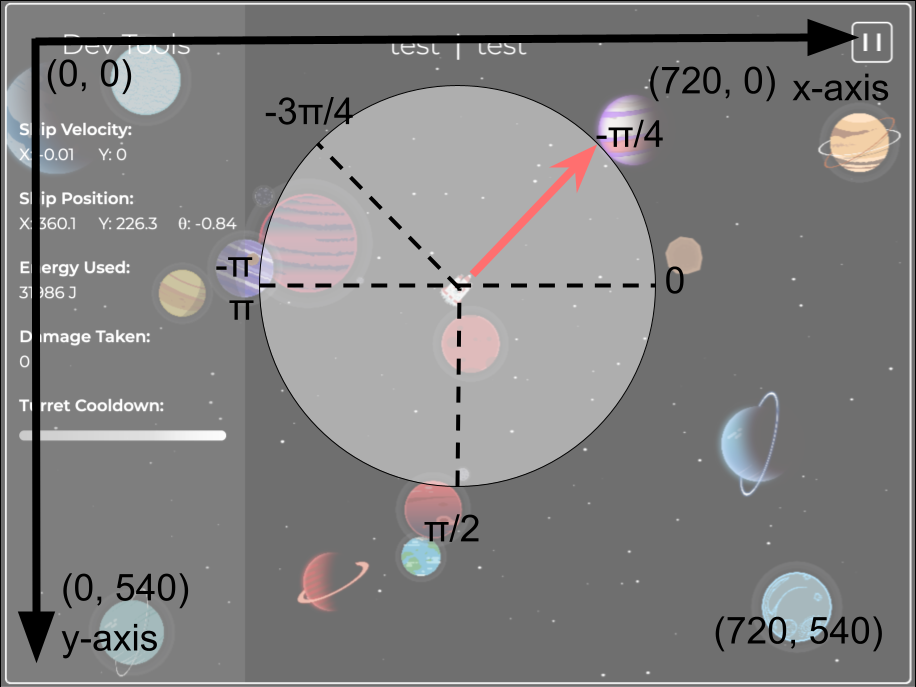

<h3 id='6.3'>6.3: Helper Libraries</h3>

We have provided you with some helper functions to help you integrate with our system.

**Vector2:**
A class for creating 2D vectors. Used for ship position, speed, acceleration, and more. You can use it like this:

```typescript
const direction = new Vector2(5, 7)
direction.add(new Vector2(1, 2))
direction.scale(2)
direction.subtract(new Vector2(2, 1))
console.log(direction.magnitude(), direction.angle())
//etc
```

**WithinPiRange**
A function that takes any angle (number) and returns it within the range -π to π.
This is very useful, since most of the API parameters expect angles in this range, but angles can still be stored and returned to you outside of this range.

```typescript
const angle = (3 * Math.PI) / 2
console.log(WithinPiRange(angle)) // prints -1.5708 (-π/2)
```

**Math Library**
Not created by us and doesn't need to be imported, but the built in Javascript Math library has numerous useful mathematical functions and constants such as `pow`, `sqrt`, `min`, `max`, `sin`, `round`, `floor`, `ceil`, `Pi`, `E`, etc. For more information, go to: https://www.w3schools.com/js/js_math.asp

<h2 id='7'>7: Student API!</h2>

To complete the activity, you need to write code to connect to the Joziac API. Your code is run in every game loop, repeatedly, so you will likely want to keep track of the game "frame" to avoid running things too quickly. For example, you could store a number that you count up every time your function is run, and only run a certain function if your number is divisible by 10.

<h3 id='7.1'>7.1: Your ship</h3>

Your ship is made up of 4 subsystems that work together to allow your ship to navigate the galaxies. No system can work without the others.

-   To find your code, open the folder `{root}/typescript/students`.
-   Open find the folder with your ship's name. example: `../Bebop`
-   You have 4 files, representing each of the subsystems. This is where you write your code.

<h3 id='7.2'>7.2: Navigation</h3>

The navigation subsystem is used for collecting internal data and performing the automated functions for warping and landing.

This subsystem's update function includes the following abilities:

-   `getShipStatus: (key: shipStatusKey) => number`
    -   ````typescript
        type shipStatusKey: 'radius' | 'angularVelocity' | 'angle' | 'positionX' | 'positionY' | 'linearVelocityX' | 'linearVelocityY' | 'thrusterPowerMain' | 'thrusterPowerBow' | 'thrusterPowerClockwise' | 'thrusterPowerCounterClockwise'```
        ````
    -   Returns the value of the specifed attribute of your ship. This is crucial for decision making.
    -   Energy Cost: 10
-   `warp: () => Error|null`
    -   Attempts to travel through a nearby warpgate.
    -   Returns null if succesful.
    -   Energy cost: 5000
-   `land: () => Error|null`
    -   Attempts to land on a nearby planet.
    -   Returns null if succesful.
    -   Energy cost: 2000
-   `getMapData: () => MapData`
    -   Returns the current map data.
    -   ```typescript
        interface MapData: {
        	solarSystemName: string
        	galaxy: GalaxyData
        }
        interface GalaxyData {
            name: string
            solarSystems: SolarSystemData[]
        }
        interface SolarSystemData {
            name: string
            warpGates: string[]
            planets: string[]
        }
        ```
    -   Energy cost: 1000

<h3 id='7.3'>7.3: Sensors</h3>

The Sensors subsystem is used for collecting external data about the solar system to help you navigate.

This subsystem's update function includes the following abilities:

-   ` activeScan: (heading: number, arc: number, range: number) => EMSReading[] | Error`
    -   Scans the area within the 'pizza slice' arc you specify for any space objects, and returns precise data about them.
    -   ```typescript
        interface EMSReading {
        	angle: number
        	distance: number
        	velocity: Vector2
        	radius: number
        	closeRange?: CloseRangeData
        }
        ```
    -   ```typescript
        interface CloseRangeData {
        	type: 'Planet' | 'Meteor' | 'Asteroid' | 'WarpGate' | 'Other'
        	planetComposition?: {
        		water: number
        		air: number
        		land: number
        		metal: number
        		safety: number
        		temperature: number
        	}
        }
        ```
    -   Energy cost: arc \* range^2 / 40
-   `passiveScan: () => PassiveReading[] | Error`
    -   Scans the entire map for any space objects, and returns imprecise data about them. The list order is **essentially random**.
    -   ```typescript
        interface PassiveReading {
        	heading: number
        	gravity: number
        }
        ```
    -   Energy cost: 2500

<h3 id='7.4'>7.4: Defence</h3>

The defence subsystem is used for defending the ship from asteroids by using the torpedo system.

This subsystem's update function includes the following abilities:

-   `aimTurret: (angle: number) => void`

    -   Sets the turret to aim at the specified angle.
    -   Energy cost: (current angle - new angle) \* 10.

-   `getTubeCooldown: (i: number) => number | Error`

    -   Returns the cooldown time of the specified torpedo tube.
    -   Energy cost: 5.

-   `fireTorpedo: (i: number) => Error | null`
    -   Tries to fire the torpedo at the specified tube.
    -   Returns null if successful.
    -   Energy cost: 8 if successful, 2 if failed.

<h3 id='7.5'>7.5: Propulsion</h3>

The propulsion subsystem is used for moving the ship.

This subsystem's update function includes just one ability. However, it is likely the most difficult to use.

-   setThruster: (thruster: ThrusterName, power: number) => Error | null
    -   Sets the power of the specified thruster. _This only needs to be done once_ to turn them on. Then once to turn them off. Not repeatedly every frame. 
    -   ```typescript
        type ThrusterName = 'main' | 'bow' | 'clockwise' | 'counterClockwise'
        ```
    -   Energy cost: 0, but you will lose energy over time based on the power of the thrusters.


<h3 id='7.6'>7.6: Integration</h3>

- To pass data to other solar systems, add additional attributes to your subsystem class.
- For example, you can create an attribute `myNumber`, and increment it each frame
```typescript
export default class YourController {
    myNumber:number = 0
    controllerUpdate() {
        //Student code goes here
        this.myNumber++
    }
}
```

- This can then be accessed in your other subsystem classes:
```typescript
export default class YourOtherController {
    controller: YourController
    otherControllerUpdate() {
	//Student code goes here
        console.log(this.controller.myNumber)
    }
}
```

- From your other subsystem, you are now able to print out the value that exists on your first subsystem!

<h3 id='7.7'>7.7: Using TypeScript</h3>

-   TypeScript must be compiled into JavaScript before it can be used.
-   Find your code files in the `typescript/students` folder.
-   To compile your TypeScript code into the JavaScript folder, run `npm run compile` in the terminal.
-   To save time, run `npm run dev` in the terminal. This will compile your code anytime you save a TypeScript file.

**When parsing an API value that could be an Error, here is a useful code segment:**
```typescript
//passiveScan: () => PassiveReading[] | Error
const scanRes = passiveScan()
if (!(scanRes instanceof Error)) {
    scanRes.forEach((reading) => {
        // do something, no type errors
    })
} else {
    // Something went wrong, you should probably log this and make sure it doesn't happen again
}
```

<h3 id='7.8'>7.8: Using JavaScript (Don't)</h3>

- If your team decides not to use TypeScript, you will have to re-enable JavaScript in VSCode.
- We recommend you use TypeScript
- TypeScript is a superior language
- Don't use JavaScript
- But if you really decide to use JavaScript:
    - Open `.vscode/settings.json`
    - Change `"**/*.js": true` to `"**/*.ts": true`
- Again, don't do that ^. Just use TypeScript instead.


<h2 id='8'>8: Advanced Information</h2>

This information is useful for identifying what type of object different scanned objects are.

| Object    | Mass           | Radius  |
| --------- | -------------- | ------- |
| Ship      | 3              | 25      |
| Planet    | ~2500 - ~29000 | 20 - 45 |
| WarpGate  | ~-100          | 15      |
| Asteroid  | 5              | 15      |
| Meteor    | 1              | 5       |
| BlackHole | Infinity       | ~40     |
| Star      | ~39000         | ~50     |

**Newton's Gravity Equation**:
- `F = ( G * m1 * m2 ) / (r^2)`
- In our Universe, G = 1/3, and Gravity is measured in force

**Max Ship Speed**: `5`

**Map Ship Angular Speed**: `0.3`

**Max landing speed**: `2`

**Torpedo Speed**: (Relative to ship): `3`

